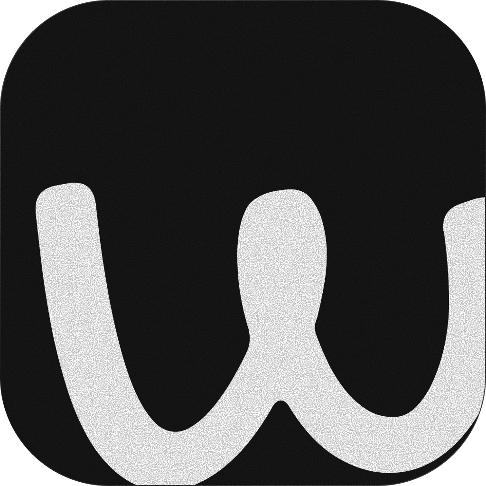

<div align="center">
  
  <h1>WriteMd</h1>
  <p><strong>Frictionless, keyboard-first Markdown editor. Open → Edit → Save.</strong></p>

  <p>
    <a href="https://github.com/danieldamilola/WriteMd Vaultreleases/latest"></a>
    <a href="LICENSE"></a>
    <a href="https://github.com/danieldamilola/WriteMd Vaultactions"></a>
  </p>
</div>

WriteMd is a fast, private, local-first Markdown editor. Double-click any `.md` file and edit it where it lives - no vault to configure, no import step, no account. New notes land in your vault (`~/Documents/WriteMd Vault/`); existing files always save back in place.

## Highlights

- **Zero friction** - open any `.md` from Explorer, drag-drop, or `Ctrl+O`; auto-save keeps you safe
- **Live Preview (WYSIWYG)** - Obsidian-style editing powered by CodeMirror 6, plus a source mode and split view
- **Private by default** - everything stays on your machine; no telemetry, no sync, no lock-in (see [PRIVACY.md](PRIVACY.md))
- **Links that work** - `[[wiki-links]]` with click-to-open, file picker, cross-folder backlinks panel, and smart website-link insertion
- **AI assistant (optional)** - bring your own key (OpenAI, Gemini, Anthropic, Ollama) to draft and edit in place
- **Rich Markdown** - tables, math (KaTeX), Mermaid diagrams, frontmatter, footnotes
- **Keyboard-first** - command palette (`Ctrl+P`), customizable shortcuts, find/replace (`Ctrl+F` / `Ctrl+H`)

> Note: the note menu has a "Callout" item that inserts `> [!note]`, but nothing
> renders callout syntax yet. It is written as a plain blockquote. Tracked in
> `phases.md`.

## Installation

Download the installer from the [Releases page](https://github.com/danieldamilola/WriteMd Vaultreleases):

| Platform | File                                                     |
| -------- | -------------------------------------------------------- |
| Windows  | `writemd-<version>-setup.exe`                            |
| macOS    | `writemd-<version>.dmg` (build from source for now)      |
| Linux    | `writemd-<version>.AppImage` (build from source for now) |

WriteMd registers itself for `.md`, `.markdown`, `.mdown`, and `.mkd` so files open in it on double-click.

## Usage

- **New note** `Ctrl+N` → created in your vault, no Save dialog
- **Open** `Ctrl+O`, drag-drop a file onto the window, or double-click in Explorer
- **Save** is automatic (debounced) - `Ctrl+S` forces it, `Ctrl+Shift+S` saves elsewhere
- **Views** - Live / Source / Split via the floating pill or `Ctrl+E`; split pane hosts files, backlinks, AI, or another document
- **Find/Replace** - `Ctrl+F` / `Ctrl+H`, with match count, case / whole-word / regex toggles
- **Links** - right-click → Add link (pick any open, recent, or vault file, or browse anywhere) inserts `[[note]]`; Add external link inserts `[text](https://…)` using your clipboard URL when there is one; clicking a `[[link]]` opens or creates the note
- **Images** - paste or drop; stored in a sibling `_assets/` folder and referenced relatively
- **Export** - PDF and standalone HTML from the note menu

### Default shortcuts

Bindings are defined in `src/renderer/src/state/shortcuts.ts` and rebindable in
Settings → Shortcuts. `Ctrl` is the `mod` slot, so it renders as `Cmd` on macOS.

| Action              | Windows/Linux                  | macOS                       |
| ------------------- | ------------------------------ | --------------------------- |
| New / Open / Save   | `Ctrl+N` / `Ctrl+O` / `Ctrl+S` | `Cmd+N` / `Cmd+O` / `Cmd+S` |
| Save As             | `Ctrl+Shift+S`                 | `Cmd+Shift+S`               |
| Find / Replace      | `Ctrl+F` / `Ctrl+H`            | `Cmd+F` / `Cmd+H`           |
| Command palette     | `Ctrl+P`                       | `Cmd+P`                     |
| Settings            | `Ctrl+,`                       | `Cmd+,`                     |
| Toggle reading view | `Ctrl+E`                       | `Cmd+E`                     |
| Split view          | `Ctrl+Alt+S`                   | `Cmd+Opt+S`                 |
| Show files panel    | `Ctrl+Shift+E`                 | `Cmd+Shift+E`               |
| Show backlinks      | `Ctrl+Shift+B`                 | `Cmd+Shift+B`               |
| Show AI panel       | `Ctrl+Alt+A`                   | `Cmd+Opt+A`                 |
| Zoom in / out / 0   | `Ctrl+=` / `Ctrl+-` / `Ctrl+0` | `Cmd+=` / `Cmd+-` / `Cmd+0` |

Export has no default binding. Run it from the note menu or the palette.

## Configuration

Settings persist to `config.json` in the app data folder and cover editor (font, line height, Vim/typewriter modes), appearance (7 themes + accent, panel orientation), vault location, recent files, open tabs, export defaults, AI provider/model/key, and shortcut overrides. See `PRD.md` §9 for the full schema.

Recent files live in `config.json` under `files.recentFiles`. There is no
IndexedDB and no separate `recent-files.json`.

## Development

Built with **Electron + TypeScript + Lit Web Components** - no renderer framework. Editor: CodeMirror 6 (Lezer) with live-preview decorations; preview parsing via markdown-it; `contextIsolation: true`, all Node access through the typed `window.electronAPI` preload bridge.

Prerequisites: Node.js 18+, pnpm.

```bash
git clone https://github.com/danieldamilola/WriteMd.git
cd WriteMd
pnpm install
pnpm dev          # hot-reload dev shell
pnpm typecheck    # must pass before anything is done
pnpm test         # unit (vitest)
pnpm test:e2e     # end-to-end (playwright + Electron)
```

Build installers (output in `dist/`):

```bash
pnpm build:win
pnpm build:mac
pnpm build:linux
```

Project layout: `src/main` (Electron main process), `src/renderer` (UI: `components/`, `state/`, `utils/`), `src/shared` (IPC types), `tests/`, `PRD.md` (product spec), `phases.md` (roadmap). Conventions live in `AGENTS.md`.

## Privacy

Local-first: notes never leave your device. The only network traffic is opt-in - your AI provider (when you configure one) and update checks against GitHub releases. Details in [PRIVACY.md](PRIVACY.md).

## License

MIT - see [LICENSE](LICENSE).
