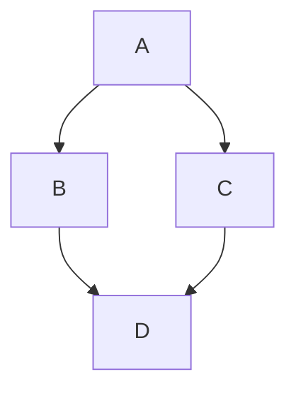

## testing rows
### cars

| Column 1 | hourse power |       design   |   engine       |
| :------: | -------- | -------- | -------- |
| toyota   | 300hp   |      basic and looks cheap    |          upgraable|
| ferarri         |          400hp|    magnifesent      |      some times hard to stock    |
| supra         |          500hp|    alright     |          twin turbo|
|          |          |          |          |


### Code Block

```typescript
function helloWorld() {
  console.log("Hello, WriteMd!");
}
```

### Math & KaTeX

Here is an inline equation: $E = mc^2$.
And a block equation:
$$
\frac{-b \pm \sqrt{b^2 - 4ac}}{2a}
$$

### Wiki-Links

Check out [[AnotherPage]] or maybe [[AGENTS.md]].

### Mermaid

