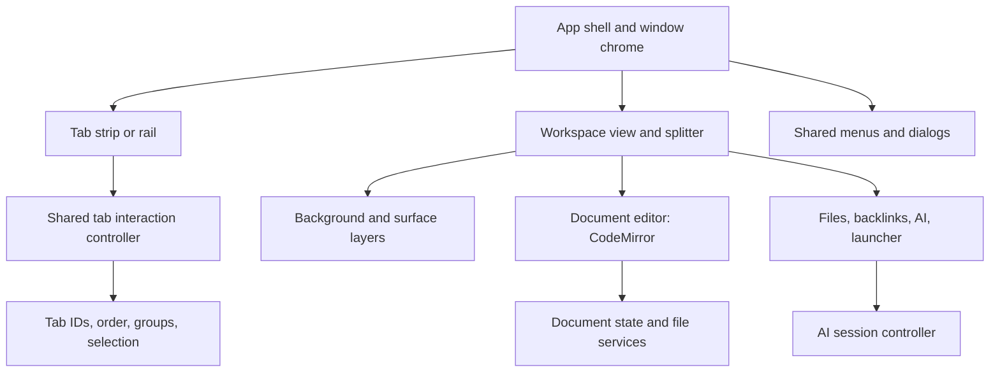

# WriteMd UI and architecture review

Reviewed 7 October 2026 against the current working tree, including the existing uncommitted changes.

Recommendation: keep Electron, TypeScript, Lit, and CodeMirror. Introduce Web Awesome for common controls, Motion for animation, and evaluate the framework-independent `@dnd-kit/dom` adapter for tabs. Refactor the workspace and interaction state before expanding the visual effects. Preserve the existing tab appearance and frame design.

Follow-up: [interaction research and OpenCode's resizable frame](UI_INTERACTION_RESEARCH.md) examines current source and toolkit guidance, defines a resizable workspace contract, and adds an important Lit integration constraint: dnd kit's default optimistic sorting also mutates DOM order. The proposed pilot disables that behavior and gives Lit ownership of preview rendering.

## Scope and evidence

The review covered the project documents, source layout, renderer components and state, preload contract, main-process services, testing configuration, and the tests around tabs, motion, settings, and split panes. The source inventory contains 99 TypeScript/CSS/HTML files; there are 56 unit-test files and 17 Electron E2E specs. Inspection concentrated on the surrounding UI rather than re-auditing every Markdown syntax extension.

The Figma frame supplied in AGENTS.md was opened. It shows the welcome screen and the existing frame/tab treatment. The supplied MonoCode screenshot is the reference for the background feature; it does not define all WriteMd workspace behavior.

An isolated Electron profile and temporary vault were used for runtime checks. No app source, existing tests, or developer preferences were changed. Reproduction code, measurements, and screenshots are in [artifacts/ui-review](../artifacts/ui-review). The requested `unslop` skill file was not found in the available skill locations; its prose instructions were followed directly.

Validation:

- `pnpm typecheck`: passed.
- `pnpm test`: 515 tests passed, but seven workers failed to start; the command failed. This is a test-runner reliability issue, not evidence that those seven files contain failing assertions.
- `pnpm test --maxWorkers=2`: all 56 files and 620 tests passed.
- `pnpm exec electron-vite build`: passed; the current renderer entry is approximately 2.57 MB uncompressed. The build warns that some dynamic imports are also statically imported, so those modules are not deferred.
- Targeted Electron E2E checks for motion, rail motion, tab overflow, and split synchronization: 13 passed, one failed. The failure is an ambiguous test locator at `tests/e2e/tab-overflow.spec.ts:67`: `.tab-add` now matches both the group button and the file button. It does not establish a product regression, but the suite needs its selector repaired. Output is in [e2e-output.log](../artifacts/ui-review/e2e-output.log).
- Additional browser measurements reproduce the problems below even with the unit suite passing. Passing unit tests does not establish interaction quality.

This is an architecture and UX review, not a complete security audit or a benchmark against other editors. Native glass was assessed for feasibility, not enabled or tested across operating systems.

## Why so much is custom

[AGENTS.md](../AGENTS.md) explicitly chooses vanilla TypeScript/Web Components with Lit allowed, and the PRD emphasizes a small dependency footprint. The implementation then builds controls and interaction machinery by hand: menus, dialogs, sliders, settings controls, drag handling, resizing, and animation helpers.

The architecture rule does not require implementing every interaction from scratch. Web Component libraries and Motion's JavaScript API fit it. WriteMd can retain its own appearance and composition while using maintained libraries for focus management, control semantics, positioning, gestures, and animation.

There is already a small set of shared primitives: `IconButton`, `Panel`, shared menu CSS, scrollbar styles, and motion helpers. These mainly share appearance. They do not provide one complete, reusable behavior contract for menus, dialogs, dragging, or pane transitions.

## Findings requiring repair

### 1. A pinned-tab drop can move the wrong tab — high priority, reproduced

The horizontal drop handler captures an array index, unpins the source, then continues moving by that old index. `unpinTab()` changes the array order first. The vertical implementation repeats the same sequence.

With two pinned tabs, dragging the first into the ungrouped list left the dragged tab near the beginning and moved the other pinned tab instead. This is a state-correctness bug; spring animation cannot repair it.

Evidence: [App.ts](../src/renderer/src/components/App.ts), lines 570–619; [VerticalTabBar.ts](../src/renderer/src/components/VerticalTabBar.ts), lines 622–667; [file-state.ts](../src/renderer/src/state/file-state.ts), line 390. The runtime JSON records the tab IDs before and after.

Repair: commit one transaction by stable tab ID, with a destination expressed as a zone/group and neighboring tab ID. Apply pinning, membership, and order changes together, then notify and persist once.

### 2. Cancellation commits a drop — high priority, reproduced

Both orientations bind `pointercancel` to the same handler as `pointerup`. That handler commits the current destination. In the browser reproduction, cancellation changed `[00, 01, 02]` into `[01, 02, 00]`.

Evidence: [App.ts](../src/renderer/src/components/App.ts), lines 570 and 707; [VerticalTabBar.ts](../src/renderer/src/components/VerticalTabBar.ts), lines 598 and 780.

Repair: separate commit from cancellation. Escape, pointer cancellation, capture loss, and teardown must clear the gesture and stop scrolling without changing persisted order.

### 3. Insertion targets and final indices disagree — high priority, reproduced

Hit testing describes an insertion position in the original array, but `moveTab()` removes the source and inserts at a final array index. Dropping a tab directly before its current next neighbor should leave the order unchanged; the reproduction swaps the two.

Evidence: [App.ts](../src/renderer/src/components/App.ts), line 498; [file-state.ts](../src/renderer/src/state/file-state.ts), line 323. The vertical handler also passes insertion indices into the same store method.

Repair: resolve relative placement after removing the dragged ID. Avoid having each orientation implement its own index corrections.

### 4. Autoscroll fights active-tab reveal — high priority, reproduced

During horizontal dragging, pointer movement changes reactive state and scrolls the strip. `App.updated()` then always calls `revealActiveTab()`. The browser measured `scrollLeft` changing to 8 inside the drag handler and returning to 0 after rendering. Holding the pointer at the edge did not continue scrolling.

Both orientations also calculate autoscroll only when pointer movement arrives, rather than on a continuing frame loop. The tab strip measures the bounds of many elements during each move.

Evidence: [App.ts](../src/renderer/src/components/App.ts), lines 457 and 1054; [VerticalTabBar.ts](../src/renderer/src/components/VerticalTabBar.ts), line 478; [horizontal drag screenshot](../artifacts/ui-review/horizontal-drag.png).

Repair: reveal the active tab on selection/visibility changes, not every render. Use a gesture-owned animation-frame loop for edge scrolling, and update collision geometry as scrolling changes. Keep pointer coordinates out of the root component's general reactive state.

### 5. Split panes overflow at the supported minimum window width — high priority, reproduced

Each pane has `min-width: 320px`; the divider needs another 5px. At an 800px window width with the vertical rail open, only 582px was available. The panes occupied 645px and the right edge reached x=858, outside the window.

The resize handler also clamps to 20–80% without reconciling those percentages with the pixel minimums. The pane's flex transition stays enabled during dragging, so the target size and the rendered size can diverge while the pointer moves.

Evidence: [Editor.ts](../src/renderer/src/components/Editor.ts), lines 224 and 2205; [narrow split screenshot](../artifacts/ui-review/narrow-split.png).

Repair: let the workspace own available width, pane minimums, and constraints. Establish a compact behavior when two minimum-size panes cannot fit. Resize directly while dragging; animate programmatic opening/closing separately. Keep the CodeMirror host independent of the splitter.

### 6. File dropping still uses a removed Electron API — high priority, reproduced

`App.handleWindowDrop()` reads `File.path`. Electron removed that property in version 32, and WriteMd uses Electron 44. The preload already exposes `webUtils.getPathForFile()` and dropped-path registration, but the window's Markdown drop path does not use them.

A native file-input/CDP fixture produced a valid path through the bridge and no `File.path`. Dispatching the drop left the active document unchanged.

Evidence: [App.ts](../src/renderer/src/components/App.ts), line 1087; [preload/index.ts](../src/preload/index.ts), line 49; [Electron webUtils documentation](https://www.electronjs.org/docs/latest/api/web-utils).

Repair: use the typed bridge to resolve the OS-backed File, register the dropped path through the existing guard, and open it. Preserve the cancellation result of `openFile()` rather than forcing the welcome state afterward.

### 7. Rail motion fades correctly but layout jumps — medium priority, reproduced

`slideOut()` animates transform and opacity. It does not shrink the rail's layout allocation. Browser samples kept the editor's left edge at x=208 throughout the fade, then jumped to x=0 when the rail unmounted. Existing rail E2E tests primarily sample opacity, so they miss this geometry discontinuity.

Evidence: [motion.ts](../src/renderer/src/utils/motion.ts), line 165; [App.ts](../src/renderer/src/components/App.ts), line 1236; [vertical-rail-motion.spec.ts](../tests/e2e/vertical-rail-motion.spec.ts).

Repair: define one reversible rail transition with an explicit closed/open layout state. Animate the allocation or coordinate a transform-based layout transition. Cancellation/retargeting must prevent stale completion callbacks from overriding newer state.

### 8. Settings reset leaves components on the old settings — medium priority, reproduced

`SettingsStore.reset()` replaces the settings and updates some DOM variables but does not notify subscribers. After resetting from vertical/full-motion settings, the stored orientation was horizontal while the component stayed vertical; stored motion was system while `data-motion` stayed full.

Evidence: [state/settings.ts](../src/renderer/src/state/settings.ts), line 65; [SettingsModal.ts](../src/renderer/src/components/SettingsModal.ts), line 1079.

Repair: have reset use the same notification path as an ordinary settings update. Batch changes, notify every affected selector, and expose persistence failure to the settings UI. Currently persistence errors are logged after the UI has already accepted the change.

### 9. Menu and dialog behavior is inconsistent — medium priority, code inspection

The horizontal and vertical tab context menus use clickable `div` rows without menu roles, focus targets, or a keyboard navigation path. Other menus, such as DocBar, have some keyboard support. Settings, confirmations, conflicts, and the command palette each implement their own focus/Escape handling. Settings and conflict dialogs explicitly trap focus while the background is not inert.

All tabs also have `tabindex="0"`, rather than a single roving tab stop. Standard interaction policies are being repaired component by component.

Evidence: [App.ts](../src/renderer/src/components/App.ts), line 822; [VerticalTabBar.ts](../src/renderer/src/components/VerticalTabBar.ts), line 912; [SettingsModal.ts](../src/renderer/src/components/SettingsModal.ts), line 847; [Tab.ts](../src/renderer/src/components/Tab.ts), line 200.

Repair: use common menu/dialog primitives, with shared positioning, dismissal, focus restoration, keyboard navigation, and modal policy. Preserve WriteMd's skin through slots, CSS parts, and tokens.

### 10. Fonts and tokens drift from the stated styling contract — medium priority, reproduced/inspected

The renderer links Google Fonts, but its CSP only permits styles from self. Electron logs the stylesheet as blocked. Geist Mono is locally bundled; the other named fonts may fall back to system fonts. This creates differences between intended and actual typography.

Components still contain hardcoded theme preview colors, fallback colors, shadow colors, sizes, and motion timings. Sharing CSS variables has not yet become a complete component-token system.

Evidence: [renderer/index.html](../src/renderer/index.html), line 9; [global.css](../src/renderer/src/styles/global.css); [SettingsModal.ts](../src/renderer/src/components/SettingsModal.ts), line 48; [ConfirmDialog.ts](../src/renderer/src/components/ConfirmDialog.ts), line 18.

Repair: bundle intended fonts locally and map all library styling through WriteMd tokens. Keep semantic colors, theme previews, surface opacity, radii, spacing, and motion policy in defined sources.

## Architecture critique

The main/renderer boundary is deliberate: context isolation, a sandboxed renderer, typed preload access, guarded file paths, atomic file replacement, settings validation, and per-session write queues are present. CodeMirror extensions are separated into modules, and expensive diagrams are lazy loaded. These are useful foundations to retain.

The renderer's ownership boundaries are much weaker:

| File                | Lines including blanks | Responsibilities currently combined                                                                                                       |
| ------------------- | ---------------------: | ----------------------------------------------------------------------------------------------------------------------------------------- |
| `Editor.ts`         |                  2,707 | CodeMirror lifecycle, workspace/frame layout, resize, surface headers, AI sessions/streams/attachments, history, notices, file navigation |
| `SettingsModal.ts`  |                  2,232 | Modal behavior, two layouts, settings snapshots, controls, provider configuration, update status, search, theme previews                  |
| `App.ts`            |                  1,521 | Root layout, horizontal tabs, groups, drag/drop, context menus, global commands, external file drops, rail motion                         |
| `AiPanel.ts`        |                  1,450 | Transcript, composer, models, popovers, Markdown rendering, staged reveal, attachment presentation                                        |
| `file-state.ts`     |                  1,304 | Documents, tabs/groups, selection, autosave, watchers, conflicts, secondary surfaces, persistence                                         |
| `VerticalTabBar.ts` |                  1,207 | A second tab/group drag implementation, menus, rename, scrolling, rendering, and store subscription                                       |

Line count alone is not a defect. The mixed ownership is: a chat feature changes the editor host; a tab gesture changes root app state; orientation changes switch between two independently maintained interaction engines.

FileState broadcasts the entire document/workspace state. App and the rail subscribe broadly; the rail is also populated through parent properties. Every document change can invalidate unrelated chrome. An instrumented burst of ten programmatic content changes produced twenty notifications and 180 calls to App's `requestUpdate()` in the current fixture. Lit coalesces these calls; this is not a measurement of 180 paints or a typing benchmark. It does show excessive propagation paths.

The active-document mirror fields in FileState also require explicit synchronization. They are managed today, but new features must remember that contract. Replace them progressively with derived selectors rather than adding more independent mutable copies.

The flat components directory hides these feature boundaries. The roadmap still calls v1.1.0 the next release while package.json is v1.3.0. The acceptance criteria do not specify the tab-drag and frame interactions the user now expects.

## Proposed structure

Make these boundaries by extracting responsibilities incrementally:

- **Workspace view/controller:** two pane slots, selected auxiliary surface, preferred pane/rail sizes, derived rendered sizes, rail visibility, responsive constraints, frame gutters, and surface headers. The inner frame resizes with its pane. Keep two panes initially; no need for a general docking framework.
- **DocumentEditor:** owns a CodeMirror view, document binding, extensions, and teardown. Workspace resize and opening AI should not rebuild it.
- **Tab interaction controller:** one identity-based transaction model shared by both orientations; one gesture lifecycle and keyboard reorder policy.
- **AI session controller:** owns streams, messages, attachments, and persistence independent of which pane is mounted. `AiPanel` renders that state and emits actions.
- **Shared UI adapters:** WriteMd wrappers around maintained library controls. Screen components consume WriteMd contracts rather than scattered vendor APIs.
- **State selectors:** preserve singleton ownership, but notify tab metadata, active document content, workspace layout, and AI state separately. Add batching for compound operations and settings persistence.

Do not add a new global state framework merely to rename the existing store. Extract tested boundaries and remove redundant notification paths first.

## Library recommendation

| Area                                                    | Recommendation                                                                  | How WriteMd keeps its appearance                                                                          |
| ------------------------------------------------------- | ------------------------------------------------------------------------------- | --------------------------------------------------------------------------------------------------------- |
| Dialogs, dropdowns, inputs, sliders, switches, tooltips | Web Awesome, imported by component                                              | Map theme tokens; customize slots and CSS parts; retain existing text, dimensions, icons, and spacing     |
| Splitter                                                | Evaluate Web Awesome's split panel inside the workspace adapter                 | Keep WriteMd pane frames, headers, gutter width, and compact behavior                                     |
| Animation                                               | Motion's JavaScript API behind a small owned controller                         | Reuse the app's reduced-motion setting and define consistent timing/spring presets                        |
| Tabs                                                    | Keep the current tab skin; pilot `@dnd-kit/dom` for shared gestures and sorting | Existing tab markup/appearance stays; library handles gesture mechanics, not the product's ordering rules |

[Web Awesome dialogs](https://webawesome.com/docs/components/dialog/) expose slots, CSS parts, and animation duration properties. Its [split panel](https://webawesome.com/docs/components/split-panel/) provides customizable divider behavior. Import individual controls and required styles locally; do not install a remote autoloader or impose the whole library's default theme on the app.

[Motion](https://motion.dev/docs/animate) supports DOM animations, springs, sequences, and playback controls without React. JavaScript Motion does not automatically supply React's `layout`/`AnimatePresence` component behavior: WriteMd still needs controlled mounting and explicit layout measurements where appropriate. One owner should animate a property; avoid concurrent splitter and Motion width/transform drivers.

The current [dnd kit](https://dndkit.com/) has a plain TypeScript/DOM API. Its inspected source contains document/ShadowRoot execution-context helpers, which is relevant to Lit. It remains a candidate until a small Electron pilot verifies nested shadow roots, pinned/grouped transfers, keyboard behavior, cancellation, and overflow. Pin the tested version; do not add the React adapter. SortableJS is a fallback candidate, but its direct DOM reordering must be reconciled with Lit's rendering ownership before adoption.

The framework-independent label alone is insufficient: Pragmatic Drag and Drop currently has an [open Shadow DOM support issue](https://github.com/atlassian/pragmatic-drag-and-drop/issues/116). That is why a generic recommendation to install any drag library would be premature.

SolidJS would make direct OpenCode component reuse easier. It would not fix these state transactions, width constraints, reset notifications, or OS API mistakes. The code evidence favors repairing the Lit implementation and adding libraries before taking on a renderer migration.

## Background image, blur, and transparency

The requested feature is feasible. The current renderer confirms CSS backdrop-filter support. Native desktop glass is a separate capability and is not enabled by the present BrowserWindow configuration.

The MonoCode source inspected alongside the screenshot separates image storage, appearance preferences, effect processing, and presentation. Its effects include None, Dither, ASCII, Halftone, Scanlines, and Haze. Pixel effects use a worker and cached results; Haze uses a separate path. Adapt these boundaries, then choose WriteMd-specific controls and defaults. [MonoCode source](https://github.com/hardbeat920/monocode).

Suggested WriteMd feature contract:

- Locally import/change/remove a background, with a preview. Store an app-owned copy so moving the original image does not break it.
- Choose a target: workspace or AI pane. Begin with one shared workspace backdrop where adjacent panes should show a continuous image; avoid accidentally duplicating the image per pane.
- Set image visibility, blur, and tint separately. Empty AI sessions can have stronger visibility than sessions containing messages, matching the screenshot's two sliders.
- Add surface opacity independently of image opacity. A readable editor surface should retain its own tint even when the frame shows more of the image.
- Ship None/Haze first; add the other effects through worker-generated cached images. Compute them when the image/effect changes, never during typing, dragging, or every animation frame.
- Persist appearance preferences through the typed settings contract. Main process imports the asset atomically; renderer receives a controlled asset ID/URL through the bridge. Match the asset and worker policy to the existing CSP rather than opening arbitrary local file access.

The frame needs an explicit layer order: native window material, workspace image, tint, translucent surfaces, content, then overlays. The current opaque body, root app, and panel backgrounds would cover underlying glass. Changing a single `background-color` or adding `backdrop-filter` to the outermost node is insufficient.

For native window effects, Electron offers Windows Mica/Acrylic background material on Windows 11 22H2+, and macOS vibrancy. The review machine is Windows 11 build 26200, so it meets that documented Windows requirement. Platform behavior still needs a dedicated prototype with maximize, resize, focus, and opaque fallback checks. [Electron BrowserWindow documentation](https://www.electronjs.org/docs/latest/api/browser-window#winsetbackgroundmaterialmaterial-windows).

Prefer those platform material APIs to making a fully transparent resizable window the default. Electron documents resize/maximize limitations for transparent windows, and CSS blur cannot blur other applications behind the window. [Transparent-window limitations](https://www.electronjs.org/docs/latest/tutorial/custom-window-styles#limitations).

This background-control layout is an adaptation of the supplied screenshot. It is a proposed WriteMd design and should be recorded in Figma when the visual direction is formalized.

## Implementation order and acceptance criteria

1. **Correct tab and file-drop behavior.** Identity-based drop transaction, correct before/after placement, cancellation, pin/group transfers, edge scrolling, and supported File-path resolution. Regression tests must reproduce the failures above. Preserve tab visuals.
2. **Extract the workspace and document host.** Centralize frame/gutters/headers and the two-pane model. Verify the 800px window, open rail, every auxiliary surface, divider keyboard input, direct resizing, and rapid open/close. Retain text, selection, scroll, and undo history while changing the surrounding UI.
3. **Pilot then adopt shared controls.** Start with a tab context menu, a settings control group, and the splitter. Match existing screenshots in both light and dark themes; verify focus, keyboard use, nested overlays, outside-click dismissal, and settings persistence before broad rollout.
4. **Replace gesture and motion infrastructure.** Validate dnd kit in one orientation, then share the controller with the other. Add smooth neighbor displacement, stable drag preview, continuous edge scrolling, and drop/cancel settling. Disable layout transitions during direct manipulation and give interrupted animations an explicit owner.
5. **Add backgrounds and surface opacity.** Implement local asset storage, preview, None/Haze, independent visibility controls, and continuous workspace layering. Test persistence, removal, theme changes, large-image handling, and typing/dragging with the feature enabled.
6. **Add optional native glass and additional image effects.** Verify platform support and fallback behavior; use workers for image processing. Keep this independent of the Markdown document contents and export appearance.
7. **Update the architecture documents and UX tests.** Replace the stale roadmap with these observable acceptance criteria. Keep a deterministic browser test matrix for horizontal/vertical tabs, narrow windows, full/reduced motion, light/dark themes, grouped/pinned tabs, cancellation, and restart persistence.

The first deliverable should be one working vertical slice: existing-looking tabs that reorder correctly and feel smooth, beside a splitter that respects available width. That is stronger evidence for the architecture than installing a library across the app before its boundaries are settled.
