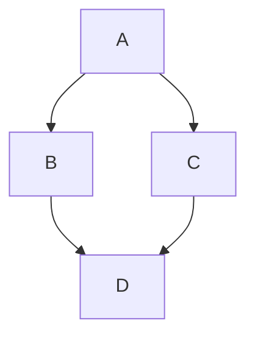

# Live preview sandbox

Open this file in WriteMd to exercise every live-preview surface. Nothing here
is real content; the tables are deliberately ragged and the frontmatter is
whatever the panel needs to render.

## Tables

Alignment markers, ragged rows and empty cells all show up here.

| Left     |  Center  |      Right | Code          |
| :------- | :------: | ---------: | ------------- |
| plain    | centered |      12345 | `inline code` |
| **bold** | _italic_ | ~~struck~~ | `const x = 1` |
|          |          |            |               |

## Code block

```typescript
export function helloWorld(): string {
  return 'Hello, WriteMd!'
}
```

## Math

Inline: $E = mc^2$. Block:

$$
\frac{-b \pm \sqrt{b^2 - 4ac}}{2a}
$$

## Wiki-links

See [[AnotherPage]] or [[AGENTS.md]].

## Mermaid


